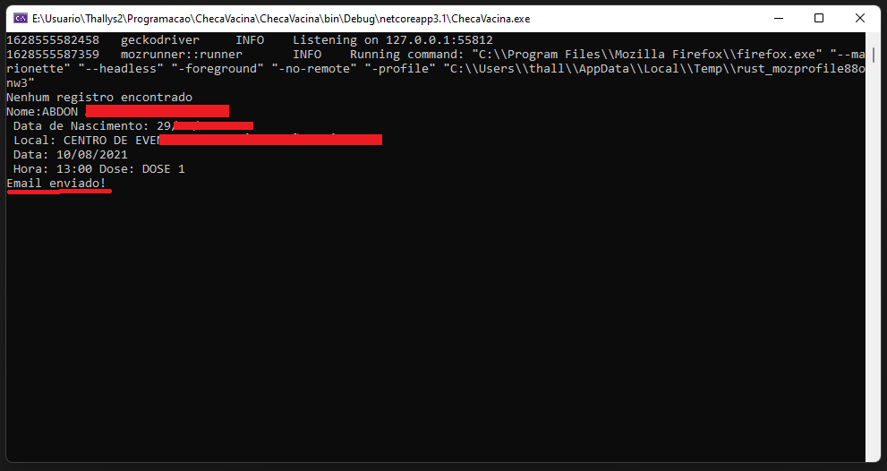

# ChecaVacina
<a href="https://docs.microsoft.com/pt-br/dotnet/csharp/"> 💻 C#</a>

<strong>Funciona apenas para o município de Fortaleza</strong>

 💉 App para te lembrar do seu dia de vacinação

<h1 align="center">
  
</h1>

## 💻 Como executar

 - Clone o repositório
 - Instale as bibliotecas, inclusive a Selenium.
 - Crie um arquivo "Appsettings.json", informando seus dados do servidor SMTP e dados do registro que deseja consultar. Exemplo:
   
 { 
  "Configuration": { 
    "Email": "seu@mail.com", 
    "Password": "senhadoseuemail", 
    "Smtp": "seusmtp.com.br", 
    "Port": 26 
  }, 
  "Pessoas": [ 
    { 
      "Nome": "Nome", 
      "Cpf": "0218548565", 
      "Email": "email@mail.com" 
    }, 
    { 
      "Nome": "nome", 
      "Cpf": "00436515553", 
      "Email": "teste@ig.com" 
    } 
  ] 
} 
 
 - Compile o aplicativo.
 - Execute o "ChecaVacina.exe"
 - Exemplo de execução:
 <h1 align="center">
  
</h1>
 - Se o seu nome aparecer na lista, um e-mail será enviado.
 
 ## Autor
  Thallys Freitas   
  Entre em contato comigo:  |

